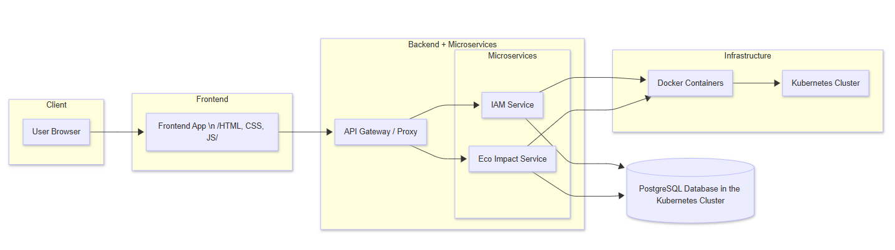

# Root-Square-Ecolator

## Описание на проекта
### Ecolator е уеб-базиран калкулатор, който помага на потребителите да оценят своя екологичен отпечатък въз основа на ежедневните им навици. Системата изчислява приблизителен коефициент на влияние върху околната среда, като взима предвид транспорт, хранителни навици, консумация на електроенергия и водни ресурси.

### Архитектура на системата:



### Файлова структура:
```
Root-Square-Ecolator/
├── .github/
│   └── workflows/
│       ├── cd.yaml
│       ├── eco-ci.yaml
│       └── ai-api-ci.yaml
├── ecolator-chart/
│   ├── charts/
│   │   ├── iam/
│   │   │   ├── templates/
│   │   │   │   ├── iam-deployment.yaml
│   │   │   │   └── iam-service.yaml
│   │   │   ├── Chart.yaml
│   │   │   └── values.yaml
│   │   └── postgres/
│   │       ├── templates/
│   │       │   ├── pg-deployment.yaml
│   │       │   └── pg-service.yaml
│   │       ├── Chart.yaml
│   │       └── values.yaml
│   ├── templates/
│   │   ├── eco-deployment.yaml
│   │   ├── eco-service.yaml
│   │   ├── ai-api-deployment.yaml
│   │   └── ai-api-service.yaml
│   ├── Chart.yaml
│   └── values.yaml
├── ecolator/
│   ├── src/
│   │   └── main/
│   │       ├── java/com/rootsquare/ecolator/
│   │       └── resources/static/
│   ├── Dockerfile
│   └── pom.xml
├── car-fuel-api/
│   ├── src/
│   │   └── main/
│   │       ├── java/com/rootsquare/carfuel/
│   │       └── resources/
│   │           └── application.properties
│   ├── Dockerfile
│   └── pom.xml
├── observability/
│   ├── alloy-config.alloy
│   ├── configmap.yaml
│   ├── deployment.yaml
│   └── service.yaml
└── README.md
```

#### Основни директории:
- .github/workflows -> CI/CD поток на приложението
- car-fuel-api -> AI API за определяне на разход на гориво
- ecolator -> Главната директория на приложението
- ecolator-chart -> Helm chart на приложението
- observability -> Observability на приложението

### Инструкции за стартиране:

#### Docker & Kubernetes

```
git clone https://github.com/TUES-2026-PBL-11-klas/Root-Square-Ecolator.git
cd Root-Square-Ecolator
```
При успешно стартиран Kubernetes Cluster (напр. Docker Desktop)
```
# Database secret
kubectl create secret generic ecolator-db-secret -n ecolator \
  --from-literal=POSTGRES_DB=<your-db-name> \
  --from-literal=POSTGRES_USER=<your-db-user> \
  --from-literal=POSTGRES_PASSWORD=<your-db-password>

# Groq API secret
kubectl create secret generic groq-secret -n ecolator \
  --from-literal=GROQ_API_KEY=<your-groq-api-key>
```

Можете да използвате безплатен GROQ AI ключ на https://console.groq.com

### Tech Stack:

> - Backend: Spring Boot / Maven (Java 21+)
> - Frontend: Vanilla (чист JavaScript, HTML и CSS)
> - База данни: PostgreSQL
> - Контейнеризация: Docker
> - Оркестрация: Kubernetes (Helmchart, CI/CD pipeline с GitHub Actions)

### API Endpoints:

| Service | Port | Responsibility |
|---|---|---|
| eco-impact (ecolator) | 8080 | Основна бизнес логика — изчисляване на емисии, управление на потребителски данни, REST API |
| ai-api (car-fuel-api) | 8085 | Groq AI интеграция за определяне на разход на гориво по модел на автомобил |
| iam-service | 8081 | Автентикация и оторизация (NodePort 30081) |
| PostgreSQL | 5432 | Релационна база — user data, reference data |
|Grafana Alloy | 4317/4318/12345 | Observability Collector — Traces, Metrics, Logs към Grafana Cloud

