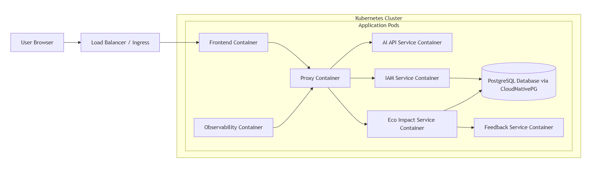
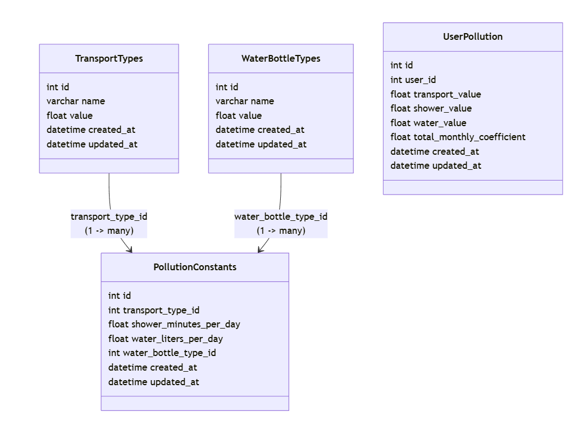
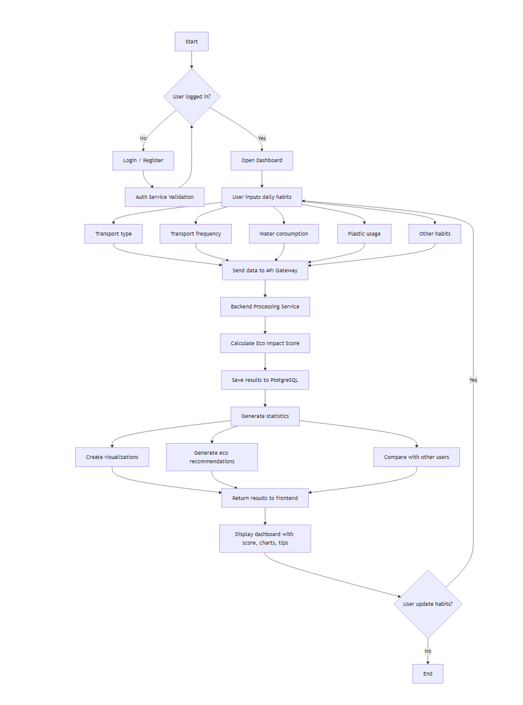
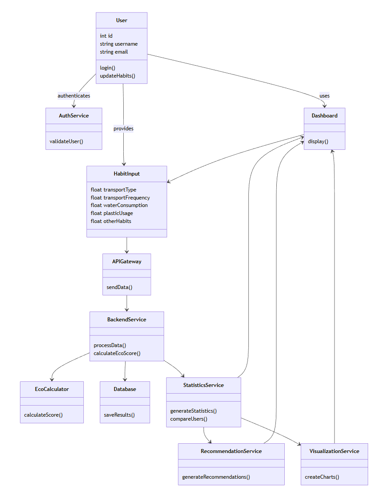

# Root-Square-Ecolator

## 1. Описание на проекта
- Уеб-базиран калкулатор, който помага на потребителите да оценят своя екологичен отпечатък въз основа на ежедневните им навици.
- Потребителят въвежда информация за дейности от ежедневието си:
  - Метод на транспорт (кола, обществен транспорт, велосипед, ходене пеша и др.)
  - Колко често използва избрания транспорт
  - Консумация на вода (приблизително дневно или седмично)
  - Употреба на пластмаса (бутилки, опаковки и др.)
  - Други ежедневни навици, които влияят върху околната среда
- Въведената информация се запазва в профил, който може да бъде редактиран въз основа прогреса на даден потребител.
- Системата изчислява приблизителен коефициент на влияние върху околната среда на база въведената информация.
- Архитектурата ще е микросървисна, за момента основните ни микросървиси за login система, Proxy API.

## 2. Проучване 
### Предметна област и Целева аудитория
- Предметна област - Екология, анализ на влиянието на обикновен гражданин върху околната среда.
- Целева аудитория - Деца и пълнолетни, желаещи да помогнат на природата.
### Преглед на съществуващи решения
- WWF (Сайт за измерване екологичен отпечатък)
  - Идеята му е подобна на нашата, потребителят въвежда входни данни за своите покупки, как се храни и с какво, транспорта, който използва, и други условия.
  - След въвеждането на данни сайтът изчислява отпечатъка в глобални хектари (gha) и показва колко "планети Земя" биха били необходими, ако всеки потребител живееше така.
- MyClimate (Сайт за измерване на въглероден отпечатък)
  - Отново се попълва такъв тип въпросник за нашето ежедневие, каква енергия използваме и как и т.н.
  - Изчислява въглеродните емисии в еквивалент на C02 (tC02e), използвайки научна информация за факторите им.
  - Предлага на потребителя начини за компенсация чрез действие и участие в проекти.
- Основна разлика, Плюсове и Минуси
  - Освен в типа отпечатък и мерната единица, основната разлика между двете е в обхвата и целта.
    - WWF е по-широк (обхваща екосистеми и други природни ресурси) и целта му е осъзнаване на начина на живот
    - MyClimate е с по-тесен обхват, фокусът му е анализ на факторите, измерване на заплахата и взимане на мерки.
  - WWF
    - Плосове - По-широк обхват, по-цялостен екологичен модел (не се ограничава до въглеродни емисии), визуализира проблема с идеята за "планетите Земя"
    - Минуси - Силно обобщен модел, не предлага директна компенсация
  - MyClimate
    - Плюсове - Основата му е изградена с научна информация и е по-обемиста и по-конкретна, анализира факторите за емисиите и дава конкретни действия за компенсация
    - Минуси - Ограничен до въглеродния отпечатък, по-труден е за разбиране, резултатите са приблизителни, не точни

## 3. Проектиране
### Функционални изисквания към системата / програмата
- Да предоставя регистрация / вход в даден профил
- Да предоставя въпросник за въвеждане на входните данни
- Да валидира въведените данни от потребителя
- Данните за всеки потребител да се запазват в базата
- Да позволява редакция на въведените данни
- Да се изчислява екологичният отпечатък
- Да се визуализира общ резултат / коефициент
- Да сравнява резултата със средни стойности
- Да връща лични препоръки за опазване на околната среда / намаляване на отпечатъка

### Архитектура на системата

### Инфраструктурна диаграма

### Схема на БД

- Може да претърпи промени

### UML диаграми

### Алгоритъм

### Class диаграма (описва алгоритъма)

 

- Примерен вариант за методи, може да претърпи промени

## 4. Функционалност на приложението
- Изчисляване на приблизителен коефициент за замърсяване
- Визуализация на резултатите
- Препоръки за намаляване на негативното въздействие върху околната среда
- Сравнение между различни навици и техния ефект върху екологията
- Сравнение на коефициента с останалите потребители

## 5. Tech Stack
- Backend: Java със Spring Boot (Maven)
- Frontend: Vanilla (JavaScript, HTML и CSS)
- База данни: PostgreSQL (CloudNativePG)
- Контейнеризация: Docker
- Оркестрация: Kubernetes (Helmchart, CI/CD pipeline с GitHub Actions)

## 6. Възможни разширения
- Графики и статистика за напредъка на потребителя
- Интеграция с външни екологични API
- Мобилна версия
